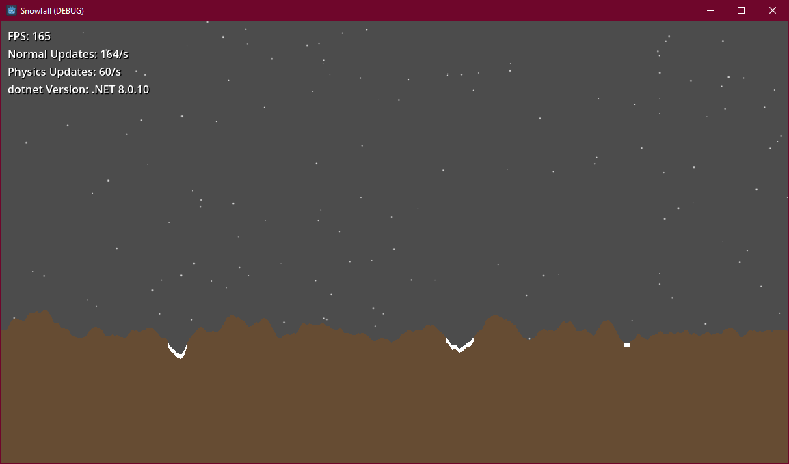

# Godot Snowfall Procedural Floor with Perlin Noise

This is a simple Godot project that creates a snowfall effect on a procedural floor using Perlin Noise. The snowflakes are generated randomly and fall down the screen, accumulating on the floor. The floor is generated using Perlin Noise to create a smooth, organic pattern.

## Features
- Snowfall effect with random snowflakes
- Procedural floor generation using Perlin Noise
- Adjustable snowfall speed and density

## How to Use
1. Open the project in Godot Engine
2. Run the project
3. Use the `Speed` and `Density` sliders in the `Snowfall` node to adjust the snowfall speed and density

## Credits

- [Godot Engine](https://godotengine.org/)